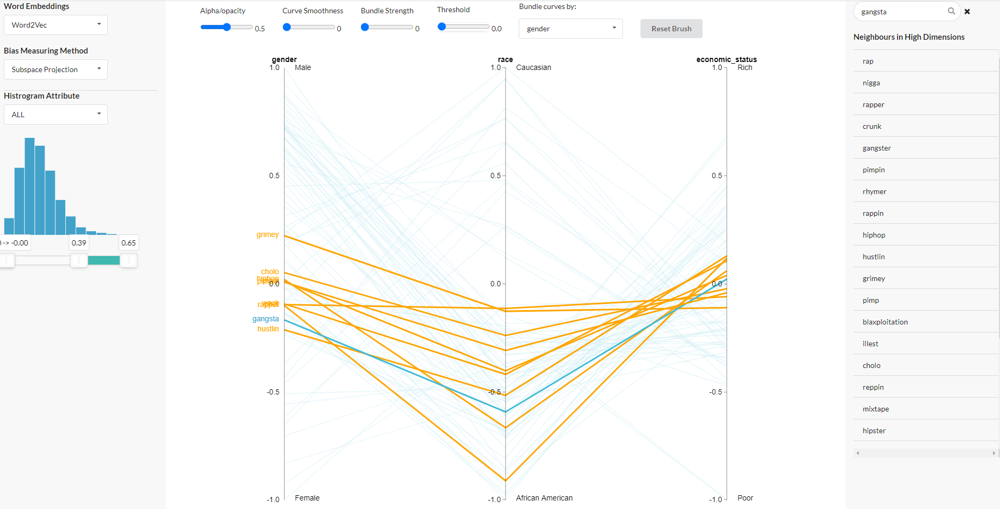

# WordBias: An Interactive Visual tool for exploring Intersectional Social biases encoded in Word Embeddings

[//]: # (Live DEMO http://130.245.128.219:6999/)
[//]: # (Documentation 
https://docs.google.com/document/d/1uw5OCxsddj8QeOqrZqgJJVBUV7rdTE9AEX9ymNzDQO0/edit?usp=sharing)

## Overview
WordBias is an interactive visual tool designed to explore biases against intersectional groups like black females, black muslim males, etc. encoded in word embeddings. Given a pretrained word embedding, WordBias computes association of each word along different groups like race, age, etc. and then visualize them using an interactive interface. Our tool aims to act as an effective <i>auditing</i> tool for experts, an <i>educational tool</i> for non-experts and enhance <i>accessibility</i> for domain experts. 

## Installation Instructions
- Clone this repo
- Install Dependencies
  - flask
  - gensim
  - numpy
  - pandas
  - sklearn
  - scipy
  - py_thesaurus
- Run python app.py
- Browse localhost:6999

## Word Lists
- [Word embeddings quantify 100 years of gender and ethnic stereotypes (Supplementary Material)](https://www.pnas.org/content/pnas/suppl/2018/03/30/1720347115.DCSupplemental/pnas.1720347115.sapp.pdf)

- [The Geometry of Culture: Analyzing the Meanings of Class through Word Embeddings](https://journals.sagepub.com/doi/pdf/10.1177/0003122419877135)

## Word Embedding
- Word2Vec embedding [Source link](https://code.google.com/archive/p/word2vec/)
- Glove Embedding [Source link](https://nlp.stanford.edu/projects/glove/)

[//] Glove embedding downloaded from this source can't be directly read by gensim. So, we will reformat it first. (see 'preprocessing word embedding' notebook)
