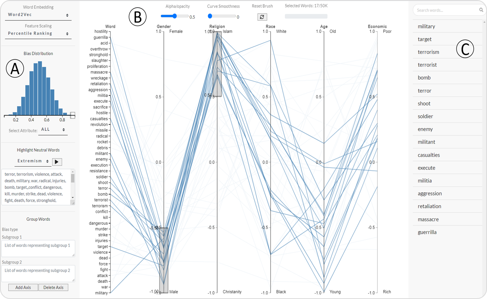

# WordBias: An Interactive Visual Tool for Discovering Intersectional Biases Encoded in Word Embeddings

- #### Read paper [PDF](https://api.deepai.org/publication-download-pdf/wordbias-an-interactive-visual-tool-for-discovering-intersectional-biases-encoded-in-word-embeddings)

- #### Live DEMO http://130.245.128.219:6999/

- #### Video Demonstration https://youtu.be/V3YM-mfpq24

Paper accepted at ACM SIGCHI 2021 Late Breaking Work



The above picture shows the visual interface of WordBias. The image can be broken into 3 parts: <br />
(A) The Control Panel provides options to select words to be projected on the parallel coordinates plot <br />
(B) The Main View shows the bias scores of selected words (blue lines) along different bias types (axes) <br />
\(C\) The Search Panel enables users to search for a word and display the search/brushing results. <br />

In the above figure, the user has brushed over 'Male' and 'Islam' subgroups. Words with strong association to both these subgroups are listed below the search box like bomb, terror, aggression, etc. This suggests that Word2vec embedding contains biases against Muslim males.

## Overview

WordBias is an interactive visual tool designed to explore biases against intersectional groups like black females, black muslim males, etc. encoded in word embeddings. Our tool considers a word to be associated with an intersectional group say ‘Christian Males’ if it associates strongly with each of its constituting subgroups (Christians and Males). Our tool aims to act as an effective <i>auditing</i> tool for experts, an <i>educational tool</i> for non-experts and enhance <i>accessibility</i> for domain experts.

## Installation Instructions

- Clone this repo

- Install Dependencies like flask, gensim, py_thesaurus, etc.

- Run python app.py

- Browse localhost:6999

## Citation

```
To be updated ...
```
